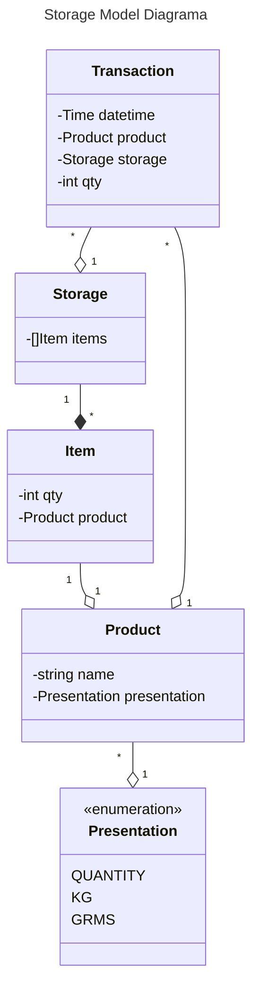
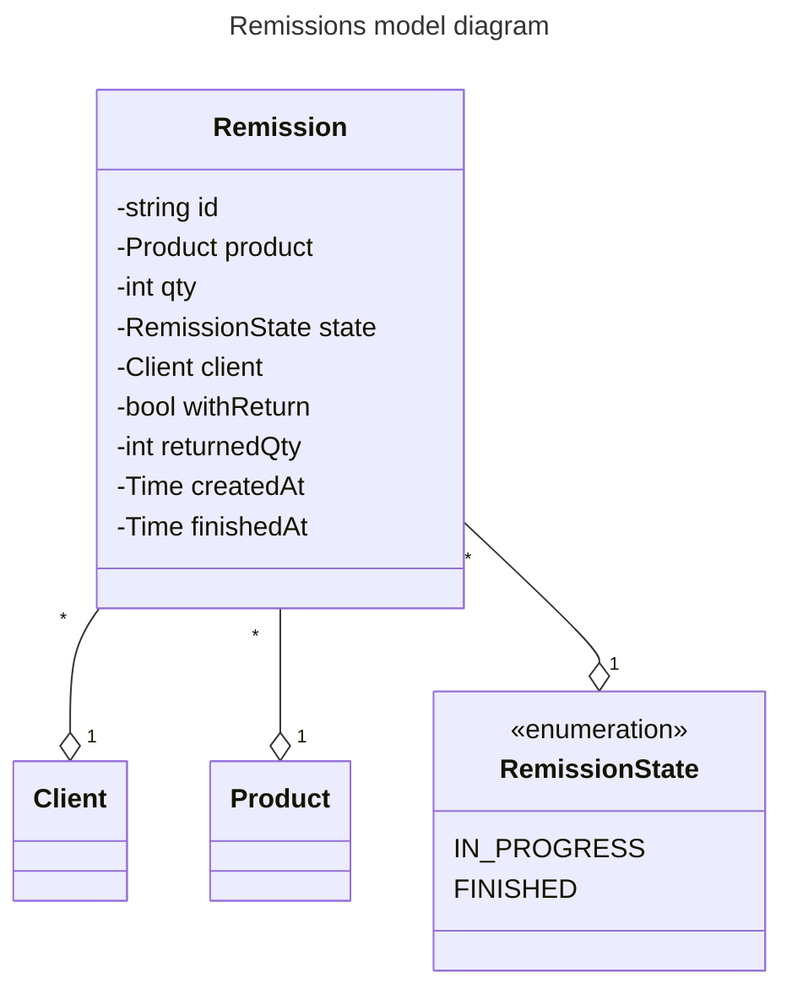

[drawer-component-url]: https://www.webcomponents.org/element/side-drawer

# Used Web Components

- [side-drawer][drawer-component-url]

# Designs

```mermaid
---
title: Storage Model Diagrama
---
classDiagram
    class Storage {
        -[]Item items
    }
    class Item {
        -int qty
        -Product product
    }

    class Product {
        -string name
        -Presentation presentation
    }

    class Presentation {
        <<enumeration>>
        QUANTITY
        KG
        GRMS
    }

    class Transaction {
        -Time datetime
        -Product product
        -Storage storage
        -int qty
    }

    Storage "1" --* "*" Item
    Item "1" --o "1" Product
    Product "*" --o "1" Presentation
    Transaction "*" --o "1" Product
    Transaction "*" --o "1" Storage
```

```mermaid
---
title: Remissions model diagram
---
classDiagram
    class Product {
    }

    class Client {
    }

    class Remission {
        -string id
        -Product product
        -int qty
        -RemissionState state
        -Client client
        -bool withReturn
        -int returnedQty
        -Time createdAt
        -Time finishedAt
    }

    class RemissionState {
        <<enumeration>>
        IN_PROGRESS
        FINISHED
    }

    Remission "*" --o "1" Client
    Remission "*" --o "1" Product
    Remission "*" --o "1" RemissionState
```