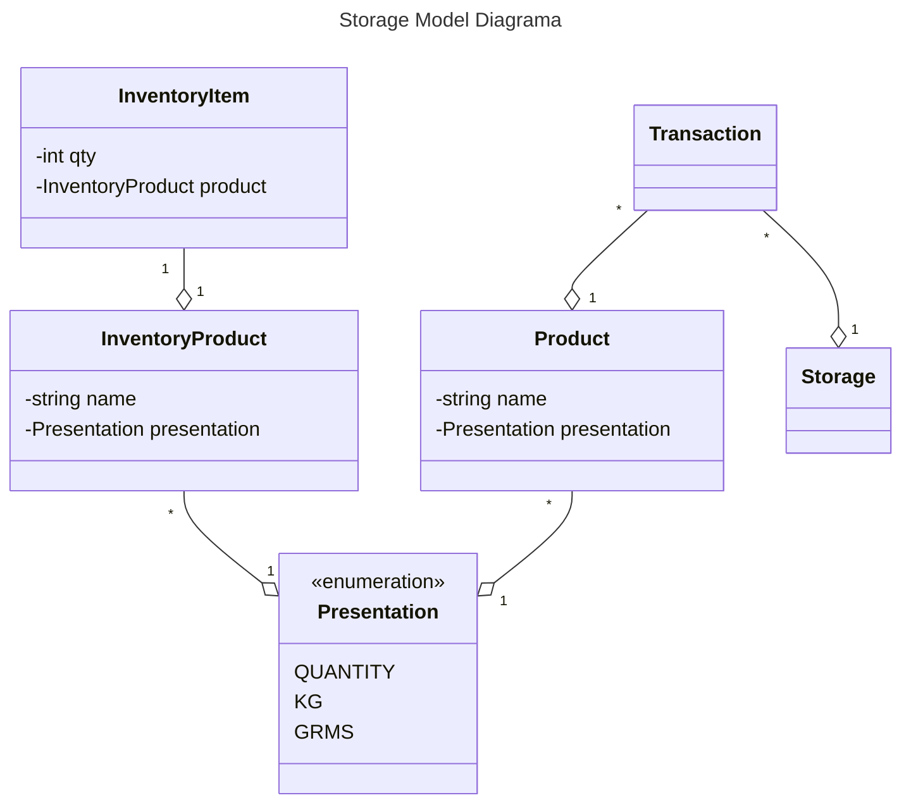
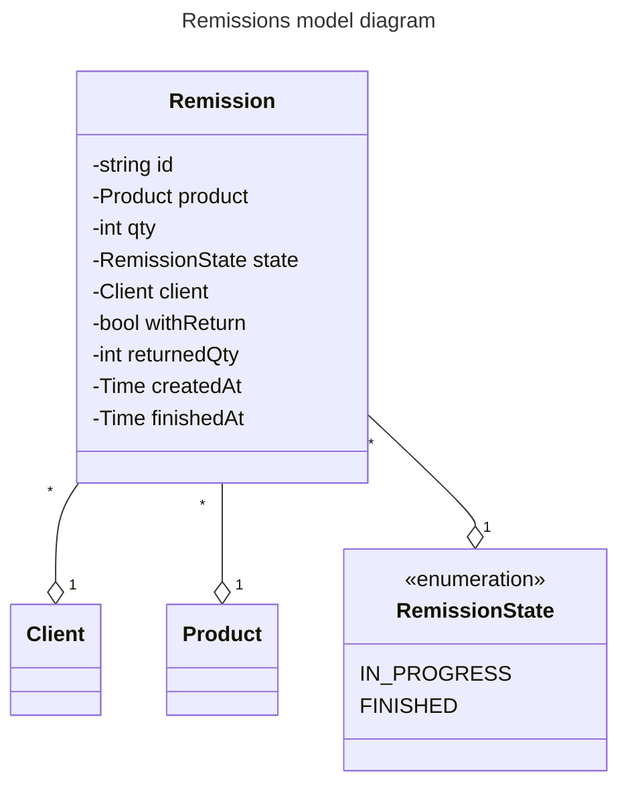

[drawer-component-url]: https://www.webcomponents.org/element/side-drawer
[playwright-url]: https://playwright.dev/

# Used Web Components

- [side-drawer][drawer-component-url]

# Run locally

Ensure that the file `.env` exists and have the value of the Client Secret for the authentication

```sh
AUTH_CLIENT_SECRET = "<<secret value>>"
```

Once this is in place, use Make to run the application locally.

```sh
make run/dev
```

# e2e

To run **e2e** (end to end) test, it can be done via make.

```sh
make e2e/dev
```

Above command will open the the [playwright][playwright-url] ui and the developer can run the **e2e** 
test from there. Remember that this will run **e2e** test in local mode therefore the application must be running 
locally.

# Designs




